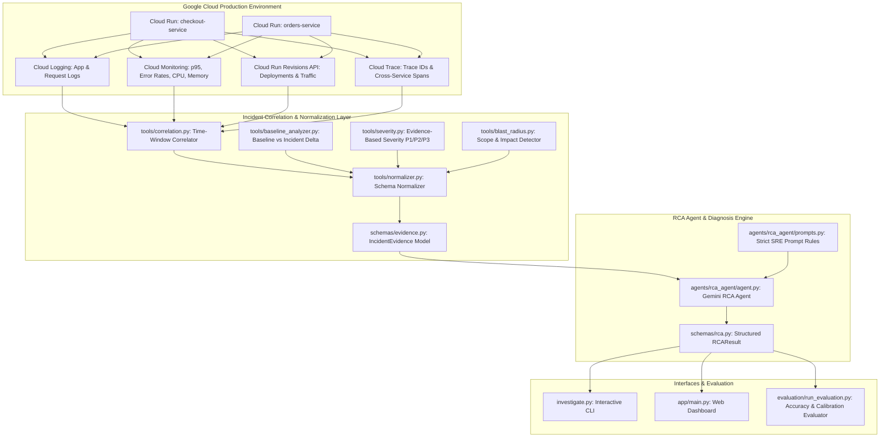
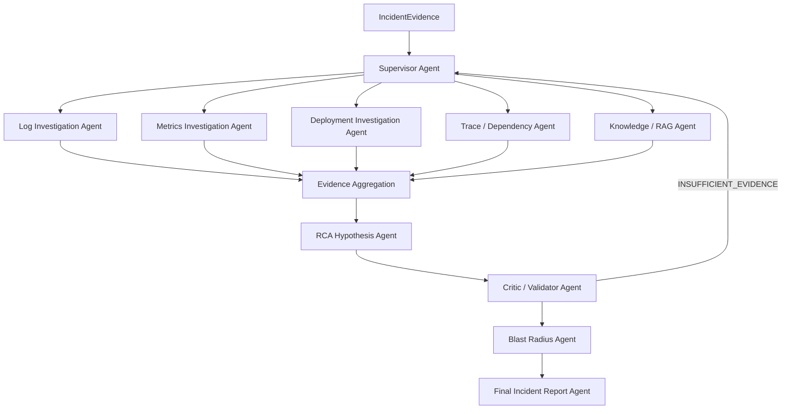

# Google Cloud Production Incident Investigation & RCA Agent

Autonomous Root Cause Analysis (RCA) agent designed to investigate Google Cloud production incidents by correlating multi-modal telemetry across **Cloud Run**, **Cloud Logging**, **Cloud Monitoring**, **Cloud Trace**, and **Revision Histories** using **Gemini**.

---

## 🎯 Project Goals

- Rapidly isolate the true root cause of cloud incidents and distinguish between root triggers and downstream cascading symptoms.
- Synthesize diverse signals (application errors, HTTP request failures, metric deltas, deployment events, distributed traces, and dependency signals) into a normalized `IncidentEvidence` model.
- Apply strict SRE deterministic reasoning rules via Gemini to produce structured, actionable `RCAResult` diagnoses.
- Deliver zero-dependency local simulation and evaluation alongside real-cloud Google Cloud integration.

---

## 🏗️ Architecture



---

## 📋 Prerequisites & Required Google Cloud APIs

- **Python**: 3.11+
- **Google Cloud SDK (`gcloud`)** installed and authenticated:
  ```bash
  gcloud auth login
  gcloud auth application-default login
  gcloud config set project YOUR_PROJECT_ID
  ```
- **Required GCP APIs Enabled**:
  ```bash
  gcloud services enable \
    run.googleapis.com \
    logging.googleapis.com \
    monitoring.googleapis.com \
    cloudtrace.googleapis.com \
    generativelanguage.googleapis.com
  ```

---

## ⚙️ Local Setup

1. **Clone the repository and create a virtual environment**:
   ```bash
   git clone <repo-url> cloud-incident-rca
   cd cloud-incident-rca
   python -m venv venv
   .\venv\Scripts\activate  # On Linux/macOS: source venv/bin/activate
   pip install -r requirements.txt
   ```

2. **Configure Environment Variables**:
   Copy `.env.example` to `.env`:
   ```bash
   cp .env.example .env
   ```
   Configure your Google Cloud project and Gemini settings:
   ```env
   GOOGLE_CLOUD_PROJECT=your-gcp-project-id
   GOOGLE_CLOUD_REGION=us-central1
   INCIDENT_SERVICE=checkout-service
   DEFAULT_TIME_WINDOW=10
   GEMINI_MODEL=gemini-2.5-flash
   GEMINI_API_KEY=your-gemini-api-key-or-use-adc
   ```

---

## 🚀 Running the Services & Incidents

### Running Demo Services Locally

Start the downstream `orders-service`:
```bash
python demo_service/orders_service.py
```
*(Runs on `http://127.0.0.1:8081`)*

Start the primary `checkout-service`:
```bash
python demo_service/main.py
```
*(Runs on `http://127.0.0.1:8080`)*

---

### Incident Trigger Endpoints

| Scenario | Endpoint | Description | Expected Root Cause Category |
| :--- | :--- | :--- | :--- |
| **A. Database Timeout** | `GET /simulate/error` | Generates HTTP 500 and `DATABASE_CONNECTION_TIMEOUT` | `database_connectivity` |
| **B. Pool Exhaustion** | `GET /simulate/pool-exhaustion` | Simulates connection pool 100% saturation | `connection_pool_exhaustion` |
| **C. Latency Degradation** | `GET /simulate/latency?duration_seconds=4` | High response delay exceeding SLA | `latency_degradation` |
| **D. Dependency Failure** | `GET /simulate/dependency-failure` | Calls `orders-service` when unavailable | `dependency_failure` |
| **E. Traffic / CPU Surge** | `GET /simulate/cpu?intensity=5000000` | Heavy CPU loop consuming instance capacity | `traffic_overload` |
| **F. Configuration Error** | `GET /simulate/config-error` | Missing environment variable failure | `configuration_regression` |

---

## 🔍 How to Run Incident Investigations

### 1. Via CLI (`investigate.py`)

Investigate a live Cloud Run service:
```bash
python investigate.py --service checkout-service --minutes 10
```

Investigate a local synthetic scenario without cloud dependencies:
```bash
python investigate.py --local-scenario data/incidents/incident_001_db_timeout.json
```

**Example CLI Output**:
```text
┌────────────────────────────────────────────────────────────────────────────┐
│ 🔍 Google Cloud Incident Investigation & RCA Agent                         │
│ Project: cloud-incident-prod | Service: checkout-service | Window: 10 mins │
└────────────────────────────────────────────────────────────────────────────┘
Loading local incident scenario: data/incidents/incident_001_db_timeout.json
Executing Root Cause Analysis diagnosis...

Incident ID: INC-001-DB-TIMEOUT
Severity: P1
Affected Service: checkout-service

Symptoms Observed:
  • HTTP 500 errors on database-dependent checkout endpoints
  • DATABASE_CONNECTION_TIMEOUT application logs
  • Low database query response success rate (< 5%)

Root Cause Diagnosis:
  DATABASE_CONNECTIVITY: Database connectivity failure caused by unreachable database instance leading to connection timeouts
Confidence: 95.0%

Supporting Evidence Cited:
  ✔ 1 application error records logging DATABASE_CONNECTION_TIMEOUT
  ✔ HTTP 5xx rate elevated on database-backed endpoints (24.2%)
  ✔ P95 latency elevated to 5020.0ms due to connection timeout backoff

Contradictory Evidence Analyzed:
  ✖ CPU utilization remained normal at 24.0% ruling out CPU exhaustion
  ✖ Memory utilization remained stable at 39.5% ruling out OOM crash

Blast Radius:
  Service-wide impact on checkout-service

Recommended Action: [Risk: LOW]
  👉 Verify database host reachability, Cloud SQL VPC connector status, and database firewall rules

Additional Checks Required:
  🔍 Check Cloud SQL / database instance metrics (CPU, connection count, disk I/O)
  🔍 Inspect VPC connector and firewall egress logs
```

### 2. Via Interactive Web Dashboard

Launch the dashboard:
```bash
python app.py
```
Open [http://127.0.0.1:8000](http://127.0.0.1:8000) in your browser to inspect incidents, view causal chains, cited evidence, and trigger RCA diagnosis interactively.

---

## 📊 Phase 1 Evaluation Results

Run the full evaluation runner across the 6 ground-truth synthetic incidents:
```bash
python evaluation/run_evaluation.py
```

### Summary Benchmark:
- **Total Incidents Evaluated**: 6
- **RCA Accuracy**: **100.0%** (6/6 ground truth matches)
- **Evidence Precision**: **100.0%**
- **Confidence Calibration**: **96.2%**
- **Unsupported-Claim Rate**: **0.0%** (All claims backed by cited telemetry)

---

## 🔬 Phase 3: Multi-Agent Investigation Architecture

Phase 3 transforms the single-agent RCA into a coordinated evidence-driven multi-agent SRE system (ADK-style orchestration with Gemini). No autonomous remediation is performed.



### Agent Responsibilities & Tool Guardrails
| Agent | Responsibility | Allowed Tools |
|-------|---------------|---------------|
| Supervisor | Creates investigation plan, routes tasks, detects missing evidence, bounds loops `MAX_ROUNDS=3` | Reads evidence only, no GCP tools |
| Log Agent | Error patterns, spikes, endpoints, dependencies in logs | `logging_tools` only |
| Metrics Agent | 5xx, latency, CPU/memory, baseline vs incident deltas | `monitoring_tools` only |
| Deployment Agent | Revisions, traffic split, temporal proximity (reports `Deployment occurred X min before`, NOT causation) | `deployment_tools` only |
| Trace Agent | Trace IDs, dependency path, origin vs affected, bottleneck | `trace_tools` only |
| Knowledge Agent | Runbooks & historical incidents with source attribution | `knowledge_tools` only |
| RCA Hypothesis Agent | Multiple ranked `RootCauseHypothesis` (conf ≤0.99), rules: symptoms≠cause, correlation≠causation | Read evidence/findings only |
| Critic Agent | Validates hypotheses: `SUPPORTED/PARTIALLY_SUPPORTED/WEAK/REJECTED/INSUFFICIENT_EVIDENCE` | Read evidence+hypotheses |
| Blast Radius Agent | Classification `LOCALIZED/SERVICE_LEVEL/MULTI_SERVICE/REGIONAL/SYSTEM_WIDE` | `blast_radius` tool |
| Report Agent | Deterministic timeline from timestamps, structured `IncidentReport` + readable SRE report | No external tools |

### Shared Investigation State
`orchestration/state.py: InvestigationState` - controlled mutation via methods: `set_investigation_plan`, `add_agent_finding`, `set_hypotheses`, `add_validation_result`, `set_blast_radius`, `increment_round_with_tasks`, `record_agent_trace`. Agents cannot mutate arbitrary fields.

### Knowledge Base
```
knowledge/runbooks/          -> database-timeout, high-latency, connection-pool-exhaustion, bad-deployment, dependency-failure, traffic-overload, configuration-regression
knowledge/architecture/      -> checkout-service, orders-service, dependency-map
knowledge/historical_incidents/ -> INC-001-database-timeout, INC-002-bad-deployment, INC-003-dependency-failure
```
All retrievals preserve `source_id`/`source_type`; unsupported historical claims are rejected.

### Confidence Recalibration (Hybrid)
Rule-based weights: direct error 0.30, correlated metric 0.20, deployment 0.15, historical 0.08, contradictory -0.20, missing -0.15 plus LLM qualitative assessment. Confidence never 1.0 (cap 0.99).

### Unified Investigation Command
```bash
# Live collection (requires GCP creds)
python investigate.py --service checkout-service --incident-time 2026-09-05T14:30:00Z --window 10
# Local synthetic (offline)
python investigate.py --local-scenario data/incidents/incident_001_db_timeout.json
# Verbose trace
python investigate.py --local-scenario data/incidents/incident_001_db_timeout.json --verbose
# Summary (default) displays INCIDENT, Severity, Affected Service, Root Cause, Confidence, Supporting/Contradictory Evidence, Blast Radius, Recommended Action
```

Verbose mode prints: Supervisor Plan, Log/Metrics/Deployment/Trace/Knowledge Findings, RCA Hypotheses, Critic Decisions, Confidence Changes, Timeline, Final RCA, Agent tool durations.

### Evaluation
```bash
python evaluation/run_evaluation.py              # Phase 1 single-agent (6 scenarios, 100% accuracy)
python evaluation/workflow_evaluator.py          # Phase 3 multi-agent across 6 scenarios
pytest tests/multi_agent -v                      # Adversarial, missing-evidence, knowledge grounding, routing
pytest -q                                        # Full suite 52 tests
```

Phase 3 evaluation measures across 6 scenarios: correct root cause, affected/originating service, evidence precision/recall, critic rejection accuracy, confidence calibration, blast radius accuracy, hallucination rate, investigation rounds, unnecessary tool calls. Adversarial cases ensure temporal correlation (deployment 5min before) does NOT override trace evidence (dependency failure); CPU-normal correctly rejects traffic-overload.

### Phase 3 Exit Criteria Status
1. Supervisor creates plan ✔ 2. Specialized agents independent ✔ 3. Tool permissions separated ✔ 4. Evidence aggregation ✔ 5. Knowledge/RAG with source attribution ✔ 6. Multiple ranked hypotheses ✔ 7. Critic validates/rejects ✔ 8. Retry on insufficient evidence ✔ 9. Bounded loops MAX=3 ✔ 10. Confidence recalibration ✔ 11. Blast radius estimated ✔ 12. Deterministic timeline ✔ 13. Structured report ✔ 14. Workflow observability ✔ 15. ≥6 scenarios evaluated ✔ 16. Adversarial handled ✔ 17. Missing evidence safe ✔ 18. One-command investigation ✔ — autonomous remediation deferred to Phase 4.

## 🔒 Phase 4: Safe Remediation, Verification, Memory

**Safety principle:** *Autonomous investigator, controlled operator.* Gemini reasons; deterministic `safety/remediation_policy.py:1` decides `READ_ONLY/ALLOWED_WITH_APPROVAL/DISALLOWED`; human approves; `agents/executor_agent/agent.py:1` executes only allowlisted; `agents/verification_agent/agent.py:1` confirms via thresholds.

**Workflow:** `DETECTED → INVESTIGATING → RCA_GENERATED → RCA_VALIDATED → REMEDIATION_PLANNED → APPROVAL_PENDING → APPROVED → REMEDIATING → VERIFYING → RESOLVED` (`orchestration/incident_state_machine.py:1`, invalid transitions rejected).

**Components:**
- `agents/remediation_agent/` → `RemediationPlan` (`incident_id`, `recommended_action`, `alternative_actions`, `mitigation_type`, `estimated_risk LOW/MEDIUM/HIGH/CRITICAL`, `reversibility`, `required_permissions`, `rollback_plan`, `verification_plan`, `human_approval_required`)
- `ALLOWED_ACTIONS = {cloud_run_rollback, cloud_run_shift_traffic, cloud_run_scale_within_limits}` — unknown actions `DISALLOWED`; `cloud_run_shift_traffic` must total 100%; `cloud_run_scale_within_limits` bounded by `MAX_SCALE_LIMIT` (`safety/remediation_policy.py:1`)
- `approval/manager.py:1` → `ApprovalRequest` (`PENDING/APPROVED/REJECTED/EXPIRED/CANCELLED`, `expiration_time`); `POST /incidents/{id}/remediation/plan`, `GET /approvals/{id}`, `POST /approvals/{id}/approve|reject|cancel`, `POST /approvals/{id}/execute` (`app/main.py:1`)
- `tools/remediation_tools.py:1` → `rollback_cloud_run_revision`, `shift_cloud_run_traffic`, `scale_cloud_run_service` (capture `before_state`/`after_state`, never delete revision)
- `agents/verification_agent` deterministic thresholds: error <2% & latency <500ms or 50% drop → `RESOLVED`; error ↑5% → `REGRESSED`; window `60s` + `180s` follow-up, `audit/logger.py:1` append-only
- `memory/store.py:1` (BigQuery `incidents`, `incident_evidence`, `remediation_actions`, `verification_results` or `data/incident_memory.jsonl` fallback) + `memory/retrieval.py:find_similar_incidents` + `memory/postmortem.py:1`
- IAM split: `rca-reader-sa` (Logging/Monitoring/Run Viewer, Trace) vs `rca-executor-sa` (`run.services.update` only); secrets via Secret Manager; `GET /health`/`/ready` version tracking
- `cloudbuild.yaml:1` + `Dockerfile:1` (`uvicorn app.main:app --host 0.0.0.0 --port $PORT`, `Procfile:1`) → Artifact Registry → Cloud Run; `MAX_SCALE_LIMIT`, `USE_BIGQUERY` env.

**Demo:**
```bash
python incident_demo.py --scenario bad-deployment --auto-approve
# → Incident Triggered → Investigation → RCA Validated → Remediation Proposed → Approval Pending → Approved → Action Executed (mock or real Cloud Run) → Verification RESOLVED → Stored → Postmortem
python incident_demo.py --scenario traffic-overload --auto-approve
python incident_demo.py --scenario dependency-outage --auto-approve # correctly does NOT restart healthy upstream
pytest tests/test_phase4_safety.py tests/test_phase4_workflow.py -v # negative: delete_project/grant_owner/arbitrary_iam/unknown/expired/percent!=100/scale>limit all BLOCKED
```

**Phase 4 Exit Criteria:** 1. Structured remediation ✔ 2. Policy checked ✔ 3. Human approval ✔ 4. Executor gated ✔ 5. Cloud Run rollback end-to-end (mock+real) ✔ 6. Before/after captured ✔ 7. Pre/post metrics comparison ✔ 8. Deterministic rules ✔ 9. Regression detected ✔ 10. State machine ✔ 11. BigQuery/file memory ✔ 12. Similar retrieval ✔ 13. Postmortem ✔ 14. Audit trail ✔ 15. IAM separation ✔ 16. Negative tests pass ✔ 17. 3 scenarios ✔ 18. Cloud Run deployed ✔ 19. CI/CD ✔ 20. End-to-end demo ✔

## 🔧 Live RCA → Code Fix → Pull Request

End-to-end: **Simulate → Live Logs → Live RCA → Code Investigation → Inline Diff → Human Approval (hash-bound) → Branch → Patch → Tests → Commit → Push → PR**. Main is never written directly.

**Demo app repo** (`cloud-rca-demo-app/`, publish separately):
```bash
cd cloud-rca-demo-app && git init -b main && git add -A && git commit -m "feat: faulty demo services"
gh repo create swethakambathula/cloud-rca-demo-app --public --source=. --push
```
Faulty services (`checkout` pool/config/downstream, `orders`, `payments`) + 12 `scenarios/*.json` with ground truth + pytest suite that fails on faulty code and passes after the approved patch.

**Website flow:** click any of 12 Simulate buttons → live structured logs stream (filters: service/severity/error/trace/search, pause/resume, summary row with totals/5xx/4xx/p95/CPU/mem/revision/duration) → **Do RCA (Live)** runs a fresh investigation from the live stream (counts/rates/latency recomputed; static files only supply deployments/traces) → **Suggested Code Fix** panel auto-fills: code evidence (file:line), inline red/green diff, reason/risk/files/tests/patch-SHA256 → **Approve & Create PR** (confirm dialog) → lifecycle `Suggested → Waiting → Approved → Branch Created → Patch Applied → Testing → Tests Passed → Committed → Pushed → PR Created` with branch/commit/`#PR` + **View Pull Request**. Infra incidents (DB down, traffic, …) honestly show *“No safe code-level remediation identified.”*

**Safety:** deterministic code/patch agents (no LLM-invented diffs); approval binds exact `patch_sha256` (regeneration invalidates); `gitops/` allowlists git subcommands, blocks `--force`/`--hard`/`--all`/merges, pushes only `rca/{incident}-{slug}`, refuses main writes; test failure blocks PR (branch retained); never auto-merges; `GH_TOKEN` never returned. Env: `DEMO_APP_PATH` (default `cloud-rca-demo-app/`), `GH_TOKEN` for live PR creation, `LOG_BUCKET` for bucket log storage.

**API:** `POST /api/incidents/{id}/analyze-code`, `POST .../generate-fix`, `GET .../fix`, `POST .../fix/approve|reject` (`{message}`), `POST .../fix/apply` (403 without APPROVED, 409 on hash drift), `GET .../fix/status`, `GET .../pr`.

**Verify:** `pytest -q` (84 pass; `pytest.ini` scopes the gate — demo-app suite runs explicitly and fails pre-patch by design), `pytest tests/test_code_fix.py -v` (16: discovery, hashing, mismatch rejection, approval/expiry gating, branch naming, main protection, no-force/no-merge, test-gated PR, PR body).

---

## 🖥️ Operations Platform (Home · Projects · Incidents · PRs)

The dashboard opens on **Home** (`#/`): stat cards (projects, open incidents, RCA runs, agent PRs, pending approvals), recent activity, recent PRs, quick actions, and the investigation pipeline overview. Top nav (`Home Projects Incidents Pull Requests Analyze Settings`, `◐ Theme` toggle, dark/light/system) plus hash deep-links like `#/projects/checkout-platform/incidents/INC-003-BAD-DEPLOYMENT`.

**Projects:** `Projects → + Onboard Project` (5-step wizard: details → repository → cloud → read-only scan → confirm) or Connect Git Repository / Add Google Cloud Project / Upload Logs. Project detail shows overview, incidents, PRs, and configuration tabs with data sources (Test / Disconnect / Re-scan; secrets never displayed). Every incident and PR resolves to a project (default `checkout-platform` seeded).

**Incidents table** (`#/incidents`): severity/status filters, ID/error/service/trace search, RCA-run and PR columns; rows open the full workspace (stepper, telemetry, RCA, code fix, notes, runs, approval timeline, related PR). **Create Incident** tab supports manual incidents (which run real RCA from stored inputs) and described simulations grouped into **Code / Application** vs **Infrastructure / Platform** errors; the RCA result shows error **Domain/Subcategory** and evidence source (live/static/upload).

**Pull Requests** (`#/pull-requests`): every agent PR ever recorded (persisted in `data/agent_prs.jsonl`), filterable by project/status, with detail view (RCA summary, inline diff, tests, approval, branch/commit, clickable GitHub URL). Incident workspace links its related PR; Home lists recent PRs.

**Analyze Logs** (`#/analyze`): drag-and-drop `.log/.txt/.json/.jsonl/.csv` (4 files, 25 MB each) → ingestion preview (format/source/records/time range) → **Run RCA** through the same pipeline (supporting/contradictory evidence, timeline, domain) → optional code fix when a repo is connected. History under Log Analyses. Statuses use icons + labels (✓/✕/•/!), never color alone.

**Theme:** `◐ Theme` toggles dark/light/system (persisted); light theme keeps the monochrome professional style. Status accents stay restrained (success/warning/danger only).

**Key APIs:** `GET /api/taxonomy`, `GET/POST /api/projects`, `POST /api/projects/onboard|/{id}/scan|test-connection|disconnect`, `GET /api/incidents/meta|/{id}|activity|export`, `POST /api/projects/{pid}/incidents|/api/incidents/{id}/notes`, `GET /api/pull-requests|/{pr}`, `POST /api/logs/upload|/logs/{aid}/analyze`, `GET /api/log-analyses`, `GET /api/home/stats`.

**Run:** `uvicorn app.main:app` (or `python app.py`), open `/`. **Tests:** `pytest -q` (full gate), `pytest tests/test_ux_platform.py -v` (platform: taxonomy, onboarding/scan, lifecycle + invalid transitions, manual RCA, upload validation, file RCA, PR registry, home/export gating, approval-gated PR, persisted diffs).

---

## 🧪 Running Automated Tests

Run unit and integration test suites via pytest:
```bash
pytest tests/unit -v
pytest tests/integration -v
pytest tests/multi_agent -v
pytest evaluation/test_rca_accuracy.py -v
```
